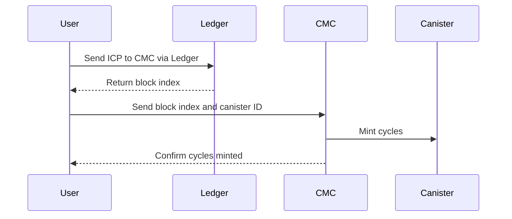

# **Minting Cycles in Motoko**

This repository provides an example of how to **programmatically mint cycles** in **Motoko** by interacting with the **ICP Ledger** and the **Cycles Minting Canister (CMC)**.

## **Overview**

To mint cycles for a canister, the process involves two main steps:
1. **Send ICP to the CMC canister** via an `icrc1_transfer` transaction on the ICP ledger.
2. **Notify the CMC** with the block index and canister ID to convert the ICP into cycles for the target canister.

### **Process Flow**



## **Project Structure**

```md
/minting_cycles
│── src/minting_cycles_backend
│   ├── utils/
│   │   ├── types/
│   ├── main.mo  # Main Motoko file handling cycle minting
│── README.md    # Project documentation
```

## **How It Works**

1. Transfers ICP to the **CMC canister**.
2. Retrieves the **block index** from the transfer.
3. Calls `notify_top_up` with the **block index** and **target canister ID**.
4. The **CMC converts ICP into cycles** and credits them to the specified canister.
